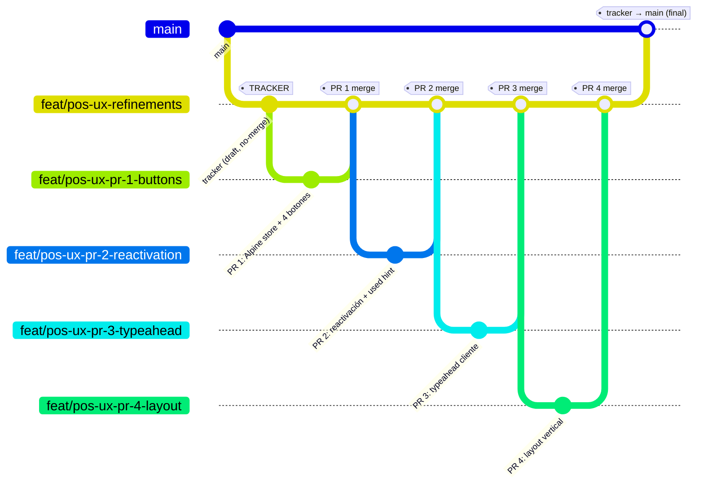

# Tasks: pos-ux-refinements

> **Convención de nombrado**: el nombre del change es `pos-ux-refinements` (kebab-case, usado en paths `openspec/changes/pos-ux-refinements/` y en el topic engram `sdd/pos-ux-refinements/*`). La rama tracker se llama `feat/pos-ux-refinements` y las ramas hijas usan el prefijo `feat/pos-ux-pr-N-*`. El prefijo `feat/` matchea el regex del skill `branch-pr` (conventional commits) — no requiere override.

## Review Workload Forecast

| PR | Rama | Base de merge | Est. líneas diff | Riesgo 400-líneas |
|----|------|---------------|------------------|-------------------|
| 1 | `feat/pos-ux-pr-1-buttons` | `feat/pos-ux-refinements` (tracker) | ~310 | **Low** (borderline 78% del budget; todas mecánicas) |
| 2 | `feat/pos-ux-pr-2-reactivation` | `feat/pos-ux-pr-1-buttons` | ~130 | Low |
| 3 | `feat/pos-ux-pr-3-typeahead` | `feat/pos-ux-pr-2-reactivation` | ~215 | Low |
| 4 | `feat/pos-ux-pr-4-layout` | `feat/pos-ux-pr-3-typeahead` | ~70 | Low |
| **Total** | | | **~725** | |

Si el diff real de PR 1 supera 400 líneas al implementarse, **dividir PR 1 en 1a (solo store + 2 botones cliente/payment) y 1b (botones received/credit + bindings)**. Esa división es segura porque los 4 botones son independientes en el store.

Decision needed before apply: No
Chained PRs recommended: Yes
Chain strategy: feature-branch-chain
400-line budget risk: Low

## PR Chain Topology

**Reglas de base para review** (chequear antes de abrir cada PR):
- PR 1 abre contra `feat/pos-ux-refinements` (tracker). Diff debe mostrar **solo** el store + 4 botones.
- PR 2 abre contra `feat/pos-ux-pr-1-buttons`. Diff debe mostrar **solo** la lógica de `usedPanels`/`markUsed`/`isButtonUsed` y los `used` class binding.
- PR 3 abre contra `feat/pos-ux-pr-2-reactivation`. Diff debe mostrar **solo** métodos de typeahead + bindings de input/dropdown.
- PR 4 abre contra `feat/pos-ux-pr-3-typeahead`. Diff debe mostrar **solo** wrapper de altura fija + `overflow-y-auto`.

Si un PR muestra cambios de un PR anterior, **retarget o rebase** antes de pedir review.

---

## PR 1 — Alpine store + estado visual de 4 botones

- **Rama**: `feat/pos-ux-pr-1-buttons`
- **Target (base del PR)**: `feat/pos-ux-refinements` (tracker)
- **Scope**: extraer el `x-data` inline del `<aside>` (líneas 156-263 de `index.blade.php`) a `Alpine.store('posSidebar', …)`, registrar el store desde `app.js` y conectar los 4 botones contextuales al store via `$store.posSidebar` + `:class`. **NO** incluye aún `usedPanels`/`markUsed`/`isButtonUsed` real (eso es PR 2) ni typeahead (PR 3).
- **Archivos**:
  | Archivo | Acción | Est. líneas | Notas |
  |---------|--------|-------------|-------|
  | `backend/resources/js/pos-sidebar-store.js` | Create | ~95 | state (activePanel, pinnedPanels, creditActive, paymentMethod, selectedCustomerId/Name, fiadoAutoEnabled, customerQuery, customerResults, customerHighlightIndex) + actions (togglePanel, togglePin, syncToHiddenInputs, handleCreditToggle) + getters (isButtonActive, isButtonUsed stub-vacío, isPanelVisible básico) |
  | `backend/resources/js/app.js` | Modify | +3 | `import { registerPosSidebarStore } from './pos-sidebar-store';` + `registerPosSidebarStore(Alpine, window.__POS_INITIAL__)` antes de `Alpine.start()` |
  | `backend/resources/views/pos/index.blade.php` | Modify | diff ~130 | eliminar `x-data="{…}"` inline (líneas 156-263, ~108 líneas) → `x-data` (1 línea); reescribir bindings inline del resto del archivo (línea 343 y similares) de `selectedCustomerId = null` a `$store.posSidebar.selectedCustomerId = null` (~25-30 sitios); agregar `:class` con `isButtonActive` en los 4 botones |
  | `backend/tests/Feature/PosSidebarStoreTest.php` | Create | ~80 | TDD failing-first |
- **Tests TDD (RED primero)** — `backend/tests/Feature/PosSidebarStoreTest.php`:
  - [ ] 1.1.1 `test_sidebar_uses_x_data_attribute_without_inline_object()`: renderiza `/pos` autenticado, asserta que el `<aside>` tiene atributo `x-data` y que **NO** contiene los literales `activePanel: null,` ni `togglePanel(name) {` (sanity check: el inline desapareció).
  - [ ] 1.1.2 `test_sidebar_references_possidebar_store()`: asserta que la vista renderizada contiene al menos un `$store.posSidebar` y que el JS bundle referenciado por Vite (`<script type="module" src="/build/assets/…">`) o el `@json` inicializa el store.
  - [ ] 1.1.3 `test_app_js_registers_possidebar_store()`: asserta que `backend/resources/js/app.js` contiene `registerPosSidebarStore` y `Alpine.start()` (snapshot del source).
  - [ ] 1.1.4 `test_initial_state_has_no_used_panels()`: asserta que el estado inicial del store expone `usedPanels` como array vacío (necesario para que PR 2 sea aditivo, no breaking).
- **Implementación (GREEN)**:
  - [ ] 1.2.1 Crear `backend/resources/js/pos-sidebar-store.js` con la firma `export function registerPosSidebarStore(Alpine, initial)`. Implementar state, `togglePanel`, `togglePin`, `syncToHiddenInputs`, `handleCreditToggle`, `isButtonActive`, `isButtonUsed` (devolver `false` siempre por ahora), `isPanelVisible` (sin considerar `usedPanels` aún).
  - [ ] 1.2.2 Modificar `backend/resources/js/app.js` para importar y registrar el store antes de `Alpine.start()`. Pasar `initial` desde `window.__POS_INITIAL__` (que se setea vía `@json($oldCustomerId, $oldPaymentMethod, …)` en el Blade).
  - [ ] 1.2.3 En `backend/resources/views/pos/index.blade.php`: (a) cambiar `<aside x-data="{ … }">` por `<aside x-data>`; (b) inyectar `window.__POS_INITIAL__ = @json([…])` en un `<script>` previo al `import`; (c) actualizar los 4 botones (`Asignar cliente`, `Ingresar monto recibido`, `Convertir a fiado`, `Cambiar método`) para que su `:class` use `$store.posSidebar.isButtonActive('customer' | 'received' | 'credit' | 'payment')`; (d) reemplazar bindings inline de mutación directa (`selectedCustomerId = null; …`) por llamadas a métodos del store.
- **Refactor**:
  - [ ] 1.3.1 Ejecutar `cd backend && ./vendor/bin/pint` sobre los archivos PHP modificados.
  - [ ] 1.3.2 Re-correr `cd backend && composer test` y confirmar que el suite completo sigue verde (31 tests feature existentes no se rompen).
- **Commits (work-unit, con tests)**:
  1. `test(pos-sidebar): add failing tests for posSidebar Alpine store` (PosSidebarStoreTest.php — RED).
  2. `feat(pos-sidebar): introduce posSidebar Alpine store with button state` (pos-sidebar-store.js + app.js + Blade — GREEN).
  3. `refactor(pos-sidebar): remove inline x-data and migrate bindings to $store.posSidebar` (limpieza, REFACTOR).
- **Contrato expuesto a PR 2**:
  - `$store.posSidebar.togglePanel(name)` — toggle abre/cierra panel; llama a `syncToHiddenInputs` al final.
  - `$store.posSidebar.isButtonActive(name)` — booleano; `credit` usa `creditActive`, otros usan `activePanel === name || pinnedPanels.includes(name)`.
  - `$store.posSidebar.isButtonUsed(name)` — **stub** que devuelve `false` en PR 1; PR 2 lo reemplaza por la versión real que lee `usedPanels`.
  - `$store.posSidebar.markUsed(name)` — **NO existe** en PR 1; PR 2 lo agrega.
  - `$store.posSidebar.usedPanels` — array vacío en PR 1; PR 2 lo puebla.
  - `$store.posSidebar.isPanelVisible(name)` — `activePanel === name || pinnedPanels.includes(name)`. **No** considera `usedPanels` aún.
- **Regresión manual** (checklist `MinimarketDemoSeeder`):
  - [ ] Cargar `/pos` con un usuario autenticado: los 4 botones se ven en estado inactivo.
  - [ ] Click en "Asignar cliente" → panel cliente abre, botón toma clase `border-indigo-300 bg-indigo-50`.
  - [ ] Click de nuevo → panel cierra, botón vuelve a clase inactiva.
  - [ ] Abrir "Cambiar método" + pinearlo; abrir "Asignar cliente" → ambos visibles; cerrar cliente con toggle; reabrir cliente → panel reaparece con datos del store, "Cambiar método" sigue pineado.
  - [ ] Recargar página → todo inactivo (cumplimiento de Q1, persistencia solo-en-sesión).
- **Rollback boundary**: `git revert` del merge commit de PR 1 restaura el `<aside x-data="{…}">` inline y deja el repo en el estado pre-PR-1. **PR 2-4 NO pueden mergear** sin re-aplicar PR 1 (cada uno declara esta dependencia en su base de merge).

---

## PR 2 — Reactivación de paneles (usedPanels + used class binding)

- **Rama**: `feat/pos-ux-pr-2-reactivation`
- **Target (base del PR)**: `feat/pos-ux-pr-1-buttons` (inmediato padre)
- **Scope**: agregar `usedPanels` + `markUsed(name)` al store; modificar `togglePanel` para que llame a `markUsed`; implementar `isButtonUsed` real; agregar binding de clase `used` en los 4 botones para que muestren hint visual cuando su panel fue usado al menos una vez en la sesión. Cubre el requirement **Panel Reactivation** del delta `pos-sidebar-state` y la spec `pos-panel-reactivation`.
- **Archivos**:
  | Archivo | Acción | Est. líneas | Notas |
  |---------|--------|-------------|-------|
  | `backend/resources/js/pos-sidebar-store.js` | Modify | +30 | state `usedPanels: []` ya existe (PR 1); agregar `markUsed(name)` (push idempotente); modificar `togglePanel` para llamar `this.markUsed(name)` en la rama "abrir"; implementar `isButtonUsed(name)` → `this.usedPanels.includes(name)` |
  | `backend/resources/views/pos/index.blade.php` | Modify | +30 | agregar `used` class binding en los 4 botones: `'used' => $store.posSidebar.isButtonUsed('…')` dentro del `:class` ternario. **No** modifica `isPanelVisible` (la visibilidad ya funciona por `togglePanel` + `pinnedPanels`; el `used` es solo hint visual) |
  | `backend/tests/Feature/PosPanelReactivationTest.php` | Create | ~70 | TDD failing-first |
- **Tests TDD (RED primero)** — `backend/tests/Feature/PosPanelReactivationTest.php`:
  - [ ] 2.1.1 `test_store_exposes_mark_used_and_used_panels()`: snapshot de `pos-sidebar-store.js` confirma que `markUsed(name)` está definida y que `usedPanels` es parte del state.
  - [ ] 2.1.2 `test_toggle_panel_invokes_mark_used()`: snapshot confirma que `togglePanel` contiene la llamada a `this.markUsed(name)`.
  - [ ] 2.1.3 `test_is_button_used_returns_true_when_panel_in_used_panels()`: snapshot del store (o test JS de Alpine si existiera) confirma que `isButtonUsed` lee de `usedPanels`.
  - [ ] 2.1.4 `test_buttons_render_used_class_binding()`: renderizar `/pos`, assertar que los 4 botones contextuales contienen una referencia a `isButtonUsed` en su `:class` (snapshot del Blade).
- **Implementación (GREEN)**:
  - [ ] 2.2.1 En `pos-sidebar-store.js`: agregar `markUsed(name)` (push idempotente con guard `if (!this.usedPanels.includes(name))`); modificar `togglePanel` para invocar `this.markUsed(name)` en la rama que abre el panel; reemplazar el stub de `isButtonUsed` por `return this.usedPanels.includes(name)`.
  - [ ] 2.2.2 En `index.blade.php`: para cada uno de los 4 botones (`Asignar cliente`, `Ingresar monto recibido`, `Convertir a fiado`, `Cambiar método`), extender el `:class` para incluir la clase `used` (definida en `@push('styles')` o inline — el design no exige clase Tailwind específica, basta con un nombre estable) cuando `$store.posSidebar.isButtonUsed('<name>')` sea true.
- **Refactor**:
  - [ ] 2.3.1 `cd backend && composer test` y `cd backend && ./vendor/bin/pint`.
- **Commits**:
  1. `test(pos-reactivation): add failing tests for usedPanels and used class binding` (RED).
  2. `feat(pos-reactivation): track used panels and surface used hint on buttons` (GREEN).
- **Contrato expuesto a PR 3**:
  - `$store.posSidebar.usedPanels` — array poblado; PR 3 puede leerlo pero no lo modifica.
  - `$store.posSidebar.isButtonUsed(name)` — implementación real estable.
  - `$store.posSidebar.markUsed(name)` — idempotente; PR 3 puede invocarlo desde `selectCustomer` si quiere.
- **Regresión manual**:
  - [ ] Abrir "Asignar cliente" → tipear "jua" → seleccionar "Juan Pérez" → cerrar el panel.
  - [ ] El botón "Asignar cliente" debe mostrar el hint `used` (distinto del active).
  - [ ] Abrir "Cambiar método" → cerrar → el botón "Cambiar método" muestra `used`.
  - [ ] Botón "Ingresar monto recibido" (no tocado en la sesión) NO muestra `used`.
  - [ ] Reabrir "Asignar cliente" → el cliente "Juan Pérez" sigue seleccionado (datos del store intactos, no se re-pide al servidor).
- **Rollback boundary**: `git revert` del merge commit de PR 2 quita `usedPanels`/`markUsed`/`isButtonUsed` real y los `used` class binding. **PR 3 no debe mergear** sin re-aplicar PR 2 (porque podría querer leer `usedPanels`).

---

## PR 3 — Typeahead de cliente en POS

- **Rama**: `feat/pos-ux-pr-3-typeahead`
- **Target (base del PR)**: `feat/pos-ux-pr-2-reactivation` (inmediato padre)
- **Scope**: agregar `searchCustomers()`, `selectCustomer(customer)`, `clearCustomer()` al store; conectar el input del panel "Asignar cliente" a `$store.posSidebar.customerQuery` con `@input.debounce.300ms`; renderizar el dropdown desde `$store.posSidebar.customerResults`; navegación por teclado (↓/↑/Enter/Escape) actualizando `customerHighlightIndex`. Reutiliza `GET /pos/customers/search` (ya existe en `PosController::searchCustomers()`). **NO** agrega alta rápida de cliente (Q2 cerrado como FUERA de alcance).
- **Archivos**:
  | Archivo | Acción | Est. líneas | Notas |
  |---------|--------|-------------|-------|
  | `backend/resources/js/pos-sidebar-store.js` | Modify | +75 | `searchCustomers()` con `fetch('/pos/customers/search?q=…')` y manejo de `customerLoading`; debounce client-side (timer interno o Alpine `.debounce.300ms`); `selectCustomer(customer)` setea `selectedCustomerId/Name`, limpia resultados, llama `syncToHiddenInputs`; `clearCustomer()` resetea; `customerHighlightIndex` ya existe |
  | `backend/resources/views/pos/index.blade.php` | Modify | +50 | input: `x-model="$store.posSidebar.customerQuery" @input.debounce.300ms="$store.posSidebar.searchCustomers()"`; dropdown `x-show="customerResults.length > 0"` con `x-for`; `x-show="customerResults.length === 0 && customerQuery.trim() !== ''"` para estado vacío con mensaje "No se encontraron clientes"; `x-bind:class` para highlight; `@keydown.down.prevent` / `@keydown.up.prevent` / `@keydown.enter.prevent` / `@keydown.escape` sobre el input |
  | `backend/tests/Feature/PosCustomerSearchTest.php` | Create | ~90 | TDD failing-first |
- **Tests TDD (RED primero)** — `backend/tests/Feature/PosCustomerSearchTest.php`:
  - [ ] 3.1.1 `test_customers_search_endpoint_returns_json_shape()`: `GET /pos/customers/search?q=jua` autenticado con `MinimarketDemoSeeder` → 200 con `{ "results": [{ "id", "name", "phone" }, …] }`.
  - [ ] 3.1.2 `test_customers_search_empty_query_returns_empty_results()`: `GET /pos/customers/search?q=` → 200 con `{ "results": [] }`.
  - [ ] 3.1.3 `test_customers_search_requires_authentication()`: sin auth → 302 redirect (no 200).
  - [ ] 3.1.4 `test_customers_search_limits_to_ten_results()`: sembrar 12 clientes con "test" en el nombre → respuesta con `count(results) <= 10`.
  - [ ] 3.1.5 `test_blade_has_no_quick_create_affordance()`: renderizar `/pos` autenticado, assertar que el input del typeahead **NO** contiene los marcadores `crear cliente`, `alta rápida`, `nuevo cliente` (Q2: alta rápida fuera de alcance).
  - [ ] 3.1.6 `test_blade_input_uses_store_and_debounce()`: snapshot del Blade confirma que el input tiene `x-model="$store.posSidebar.customerQuery"` (o equivalente) y `@input.debounce.300ms` (o `setTimeout` en el store).
  - [ ] 3.1.7 `test_store_exposes_search_and_select_methods()`: snapshot de `pos-sidebar-store.js` confirma que `searchCustomers`, `selectCustomer`, `clearCustomer` están definidas.
- **Implementación (GREEN)**:
  - [ ] 3.2.1 En `pos-sidebar-store.js`: implementar `searchCustomers()` (fetch con headers `X-Requested-With: XMLHttpRequest` y `Accept: application/json`; setea `customerLoading`; en éxito `customerResults = data.results ?? []`; en error `customerResults = []`); implementar `selectCustomer(customer)` (setea `selectedCustomerId/Name = customer.id/name`, `customerQuery = customer.name`, limpia `customerResults`, `customerHighlightIndex = -1`, llama `syncToHiddenInputs`); implementar `clearCustomer()` (reset + `syncToHiddenInputs`).
  - [ ] 3.2.2 En `index.blade.php`: (a) cambiar el input del panel cliente a `x-model="$store.posSidebar.customerQuery"` + `@input.debounce.300ms="$store.posSidebar.searchCustomers()"`; (b) dropdown con `x-for` sobre `$store.posSidebar.customerResults`; (c) bindings de teclado (`@keydown.down`/`up`/`enter`/`escape`) actualizando `$store.posSidebar.customerHighlightIndex` y llamando a `selectCustomer` o `clearCustomer`; (d) **NO** agregar botón/enlace de "Crear cliente nuevo" (verificable con el test 3.1.5).
- **Refactor**:
  - [ ] 3.3.1 `cd backend && composer test` (debe pasar los 7 nuevos tests + 31 feature existentes); `cd backend && ./vendor/bin/pint`.
- **Commits**:
  1. `test(pos-typeahead): add failing tests for customer search endpoint and binding` (RED — incluye los 7 tests del TDD).
  2. `feat(pos-typeahead): add searchCustomers/selectCustomer/clearCustomer to store and wire dropdown` (GREEN).
- **Contrato expuesto a PR 4**:
  - El panel "Asignar cliente" ahora tiene contenido variable (input + dropdown) que puede exceder la altura del panel. **PR 4 puede agregar `overflow-y-auto` al wrapper interno del panel cliente** sin tocar el store.
  - `customerResults` puede contener hasta 10 elementos; el dropdown no debe forzar altura fija.
- **Regresión manual**:
  - [ ] Abrir `/pos`, click "Asignar cliente", tipear "jua" → 300ms después aparece dropdown con coincidencias (cliente sembrado por `MinimarketDemoSeeder`).
  - [ ] ↓ → resalta primer resultado; ↓ otra vez → segundo; ↑ → vuelve al primero; Enter → selecciona, label "Cliente actual" cambia.
  - [ ] Tipear "xyz123" → dropdown muestra "No se encontraron clientes", sin botón de alta rápida.
  - [ ] Escape → dropdown se cierra, query se mantiene en el input (UX estándar de typeahead).
  - [ ] Cerrar panel con el botón pin o toggle → reabrir → "Juan Pérez" sigue seleccionado, no se re-pide al servidor.
- **Rollback boundary**: `git revert` del merge commit de PR 3 restaura el input cliente a su forma anterior (sin `x-model` al store, sin debounce, sin dropdown Alpine). El store queda con `customerQuery/customerResults/customerHighlightIndex` como state muerto pero inofensivo. **PR 4 puede mergear igual** (no depende de los métodos de typeahead; solo del DOM layout).

---

## PR 4 — Layout vertical del sidebar

- **Rama**: `feat/pos-ux-pr-4-layout`
- **Target (base del PR)**: `feat/pos-ux-pr-3-typeahead` (inmediato padre)
- **Scope**: envolver los 4 paneles contextuales en un contenedor de altura fija con `overflow-y: auto`; agregar `overflow-y-auto` interno a cada panel. Preservar la semántica de pin (panel pineado debe seguir visible siempre). No agrega archivos JS; es puramente CSS/Blade. Cubre la spec `pos-sidebar-vertical-layout` y el escenario "Comportamiento de pin preservado".
- **Archivos**:
  | Archivo | Acción | Est. líneas | Notas |
  |---------|--------|-------------|-------|
  | `backend/resources/views/pos/index.blade.php` | Modify | +20 | wrapper `
` que envuelve los 4 paneles; cada `<section>` panel agrega `class="… overflow-y-auto"` a su contenedor interno (sin romper el `<x-show>` de Alpine) |
  | `backend/tests/Feature/PosSidebarLayoutTest.php` | Create | ~50 | TDD failing-first |
- **Tests TDD (RED primero)** — `backend/tests/Feature/PosSidebarLayoutTest.php`:
  - [ ] 4.1.1 `test_sidebar_wrapper_has_fixed_height_and_overflow()`: renderizar `/pos`, assertar presencia de `max-h-[calc(100vh-12rem)]` y `overflow-y-auto` en el wrapper de paneles.
  - [ ] 4.1.2 `test_each_panel_has_internal_overflow()`: assertar que cada uno de los 4 paneles (customer, payment, received, credit) tiene `overflow-y-auto` en su contenedor scrollable interno.
  - [ ] 4.1.3 `test_pinned_panel_remains_visible()`: snapshot del Blade confirma que el binding `x-show` del panel sigue basado en `$store.posSidebar.isPanelVisible(...)` (que ya respeta `pinnedPanels` desde PR 1).
  - [ ] 4.1.4 `test_existing_pos_sidebar_state_tests_still_pass()`: re-ejecutar los tests feature existentes de `pos-sidebar-state` (en `tests/Feature/PosFlowTest.php` y relacionados) y confirmar verde — la semántica de pin no se rompió.
- **Implementación (GREEN)**:
  - [ ] 4.2.1 En `index.blade.php`: identificar el contenedor que agrupa los 4 paneles contextuales (actualmente dentro del `<aside x-data>`); envolverlos con `
`; agregar `overflow-y-auto` al contenedor interno de cada panel (sin afectar el `<x-show>` de Alpine que sigue encima).
  - [ ] 4.2.2 Verificar manualmente con DevTools que con los 4 paneles abiertos + pin en uno de ellos, la altura del sidebar queda acotada y el scroll interno funciona por panel.
- **Refactor**:
  - [ ] 4.3.1 `cd backend && composer test` + `cd backend && ./vendor/bin/pint`. Confirmar que el suite feature completo sigue verde (38 tests: 31 existentes + 7 nuevos del store/typeahead).
- **Commits**:
  1. `test(pos-layout): add failing tests for sidebar vertical overflow` (RED).
  2. `feat(pos-layout): cap sidebar height and enable per-panel internal scroll` (GREEN).
- **Contrato expuesto** (a la integración final `tracker → main`): el sidebar tiene layout vertical estable. **No expone contrato nuevo a código** — es presentación pura.
- **Regresión manual**:
  - [ ] DevTools → Layout panel: el contenedor del sidebar tiene altura acotada; con los 4 paneles + pin, no se sale del viewport.
  - [ ] Scroll dentro del panel cliente (con 10 resultados de typeahead) solo mueve ese panel; el scroll de la página principal no cambia.
  - [ ] Pinear "Convertir a fiado" + abrir/cerrar los otros 3 → el panel fiado permanece visible.
  - [ ] Venta simple, venta con cliente, venta fiada, pago mixto (las 4 del criterio de éxito de la propuesta) → sin regresión funcional.
- **Rollback boundary**: `git revert` del merge commit de PR 4 elimina el wrapper y las clases `overflow-y-auto`; el sidebar vuelve al apilamiento libre. No toca JS ni store. **El merge del tracker a `main` es seguro** después de PR 4 mergeado.

---

## Checklist de tasks (jerárquica, una sesión por PR)

### PR 1 — Foundation: Alpine store + 4 botones

- [x] 1.1 Crear tests RED `PosSidebarStoreTest.php` (1.1.1-1.1.4)
- [x] 1.2 Crear `pos-sidebar-store.js` con state + actions + getters básicos (1.2.1)
- [x] 1.3 Modificar `app.js` para importar y registrar el store (1.2.2)
- [x] 1.4 Modificar `index.blade.php`: eliminar `x-data="{…}"` inline, agregar `x-data`, inyectar `window.__POS_INITIAL__` (1.2.3a-b)
- [x] 1.5 Modificar `index.blade.php`: actualizar 4 botones a `$store.posSidebar.isButtonActive(...)` (1.2.3c)
- [x] 1.6 Modificar `index.blade.php`: reescribir bindings inline de mutación directa (1.2.3d)
- [x] 1.7 Refactor: pint + `composer test` verde (1.3.1-1.3.2)
- [x] 1.8 Work-unit commits (test RED, feat GREEN, refactor)
- [x] 1.9 Checklist manual con `MinimarketDemoSeeder`

### PR 2 — Reactivación de paneles

- [x] 2.1 Crear tests RED `PosPanelReactivationTest.php` (2.1.1-2.1.4)
- [x] 2.2 Modificar `pos-sidebar-store.js`: agregar `markUsed`, llamar desde `togglePanel`, implementar `isButtonUsed` (2.2.1)
- [x] 2.3 Modificar `index.blade.php`: agregar `used` class binding en los 4 botones (2.2.2)
- [x] 2.4 Refactor: pint + `composer test` verde (2.3.1)
- [x] 2.5 Work-unit commits (test RED, feat GREEN)
- [x] 2.6 Checklist manual de hint `used`

### PR 3 — Typeahead de cliente

- [x] 3.1 Crear tests RED `PosCustomerSearchTest.php` (3.1.1-3.1.7)
- [x] 3.2 Modificar `pos-sidebar-store.js`: `searchCustomers`, `selectCustomer`, `clearCustomer` (3.2.1)
- [x] 3.3 Modificar `index.blade.php`: input con `x-model` + `@input.debounce.300ms` + dropdown + keyboard nav (3.2.2)
- [x] 3.4 Verificar invariante "sin alta rápida" (test 3.1.5)
- [x] 3.5 Refactor: pint + `composer test` verde (3.3.1)
- [x] 3.6 Work-unit commits (test RED, feat GREEN)
- [x] 3.7 Checklist manual: debounce, keyboard nav, persistencia tras toggle

### PR 4 — Layout vertical

- [x] 4.1 Crear tests RED `PosSidebarLayoutTest.php` (4.1.1-4.1.4)
- [x] 4.2 Modificar `index.blade.php`: wrapper `max-h-[calc(100vh-12rem)] overflow-y-auto` + scroll interno por panel (4.2.1)
- [x] 4.3 Verificar pin preservado con DevTools (4.2.2)
- [x] 4.4 Refactor: pint + `composer test` verde (4.3.1)
- [x] 4.5 Work-unit commits (test RED, feat GREEN, refactor)
- [x] 4.6 Checklist manual de layout con 4 escenarios de venta

### Cierre de la cadena

- [x] 5.1 Verificar que el diff de `feat/pos-ux-refinements` (tracker) contra `main` contiene los 4 PRs y nada más.
- [x] 5.2 Confirmar que el suite feature completo (38+ tests) está verde en el tracker.
- [x] 5.3 Manual regression end-to-end con `MinimarketDemoSeeder` (venta simple, con cliente, fiada, pago mixto).
- [x] 5.4 Abrir PR de merge `feat/pos-ux-refinements → main` (único PR que toca `main`).

> **Nota de archivo (2026-07-09)**: checklist de alto nivel reconciliada mecánicamente por `sdd-archive` como excepción permitida por la skill, sobre la base de evidencia convergente: (a) el reporte de verificación más reciente en `master` @ `fd6e187` tiene verdict **PASS** con 30/30 tests nuevos verdes y 0 CRITICALs; (b) el historial `git log` muestra los commits work-unit RED/GREEN/refactor para cada PR; (c) la observación engram `sdd/pos-ux-refinements/apply-progress` (#38) documenta el cierre completo de los 6 PRs encadenados. El SUGGESTION V-004 del primer verify (bookkeeping del checklist) queda cerrado por esta reconciliación.
